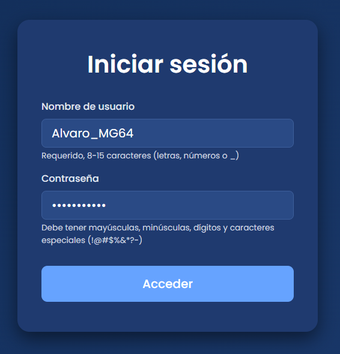
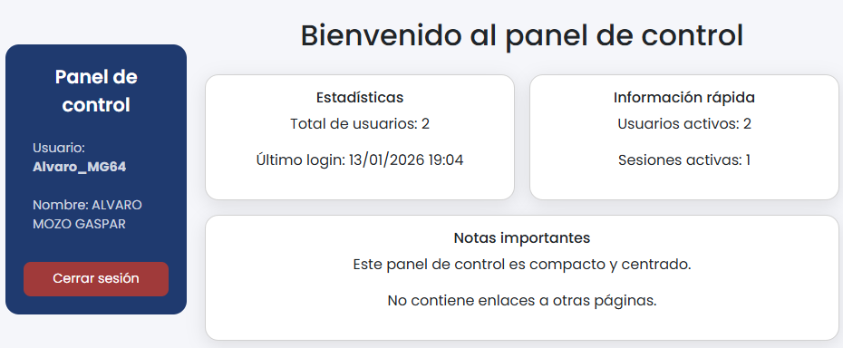

# LoginMVC

## 📌 Descripción

**LoginMVC** es una mini-aplicación de autenticación de usuarios desarrollada en **PHP** siguiendo el patrón **Modelo-Vista-Controlador (MVC)**.  
El objetivo del proyecto es aplicar de forma práctica todas las medidas de **seguridad PHP-MySQL** vistas en clase, manteniendo una estructura clara, didáctica y funcional.

La aplicación permite iniciar sesión a usuarios existentes almacenados en base de datos, gestionando las sesiones de forma segura y validando correctamente las credenciales mediante contraseñas almacenadas con **hash seguro**.

---

## 📂 Estructura del proyecto

El proyecto se organiza siguiendo una estructura MVC sencilla, separando responsabilidades y facilitando el mantenimiento del código:

LoginMVC  
- **index.php** → Punto de entrada único (Front Controller)  
- **generar_insert_hash.php** → Script PHP para generar INSERTs con contraseñas cifradas  
- **usuarios.sql** → Script de creación e inserción de la base de datos  
- **config/**
  - **Database.php** → Configuración y conexión a la base de datos mediante PDO  
- **controllers/**
  - **AuthController.php** → Controlador de autenticación (login, logout, dashboard)  
- **models/**
  - **Usuario.php** → Modelo que gestiona el acceso a la tabla usuarios  
- **views/**
  - **login.php** → Vista del formulario de inicio de sesión  
  - **dashboard.php** → Vista protegida tras iniciar sesión  
- **public/**
  - **js/**
    - **validaciones.js** → Validación JavaScript del formulario de login  
- **Captura1.png** → Captura de la pantalla de login  
- **Captura2.png** → Captura del dashboard tras iniciar sesión  

---

## 🗄️ Base de datos

La base de datos utilizada se llama **login-php** y contiene una única tabla llamada **usuarios**, con la siguiente estructura:

- **coduser** → Clave primaria autoincremental  
- **idusuario** → Nombre de usuario único  
- **password** → Contraseña almacenada mediante hash seguro  
- **nombre** → Nombre del usuario  
- **apellidos** → Apellidos del usuario  
- **admitido** → Campo booleano (TINYINT) que indica si el usuario está admitido  

En este proyecto, el campo **admitido** siempre vale `1`, aunque se mantiene para futuras prácticas donde se requerirá control de acceso adicional.

---

## 🔐 Generación correcta de contraseñas (sin terminal)

Para garantizar que las contraseñas almacenadas en la base de datos coincidan con las usadas en el login, se incluye el archivo:

**generar_insert_hash.php**

Este archivo genera automáticamente los **INSERTs** con las contraseñas cifradas usando `password_hash`, sin necesidad de usar terminal ni comandos externos.

### Uso del generador

1. Colocar `generar_insert_hash.php` en la raíz del proyecto.  
2. Abrir en el navegador:  
   `http://localhost/LoginMVC/generar_insert_hash.php`  
3. Copiar los INSERTs generados.  
4. Pegarlos en `usuarios.sql`, sustituyendo cualquier INSERT anterior.  
5. Importar `usuarios.sql` en MySQL (phpMyAdmin).

De este modo, el login funcionará correctamente con `password_verify`.

---

## ⚙️ Funcionalidades de seguridad implementadas

Este proyecto cumple **íntegramente** el enunciado propuesto por la profesora:

### ✔ Validación JavaScript
- Validación de los campos `idusuario` y `password`.
- Control de longitud y formato.
- Prevención de envíos incorrectos desde el frontend.

### ✔ Sanitización PHP
- Limpieza de datos recibidos por POST.
- Prevención de inyecciones y datos maliciosos.

### ✔ Cookies de sesión seguras
- Cookies configuradas con:
  - `httponly`
  - `samesite=Strict`
  - `path=/`

### ✔ Sesión segura
- Regeneración del ID de sesión tras el login.
- Token CSRF para formularios.
- Límite de tiempo por inactividad.
- Destrucción completa de sesión en logout.

### ✔ Consultas preparadas
- Uso de **PDO** y sentencias preparadas para todas las consultas SQL.

### ✔ Almacenamiento seguro de contraseñas
- Contraseñas almacenadas con `password_hash`.
- Verificación mediante `password_verify`.

### ✔ Control de intentos (opcional)
- Límite de intentos de acceso por sesión.
- Bloqueo temporal al superar el límite.

---

## 🎨 Estilo visual

- **Framework:** Bootstrap 5.3  
- **Diseño:** tarjetas centradas, formularios claros y legibles  
- **Colores:** tonos oscuros con buen contraste  
- **Usabilidad:** textos visibles y campos claramente identificados  

---

## 📸 Capturas de la aplicación

### Pantalla de inicio de sesión

### Dashboard tras iniciar sesión

---

## 🚀 Uso básico del proyecto

1. Clonar el repositorio.  
2. Abrir `generar_insert_hash.php` en el navegador.  
3. Copiar los INSERTs generados.  
4. Pegarlos en `usuarios.sql`.  
5. Importar `usuarios.sql` en MySQL.  
6. Abrir `index.php` en el navegador.  
7. Iniciar sesión con los usuarios definidos en la base de datos.

---
